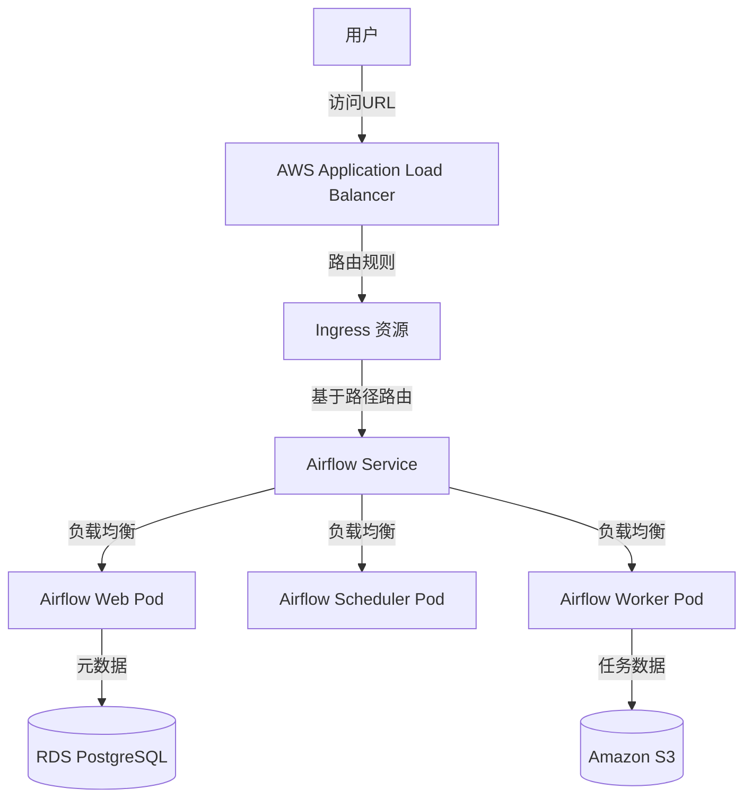
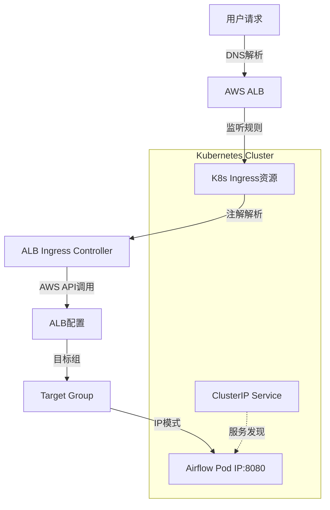
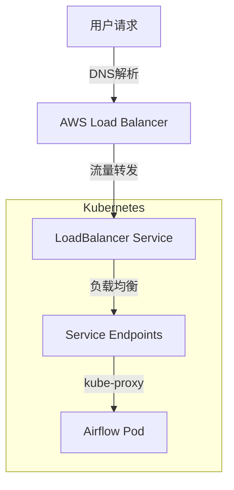
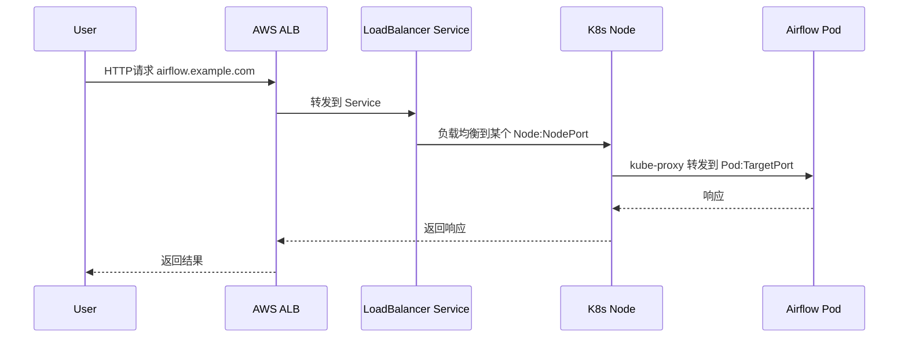
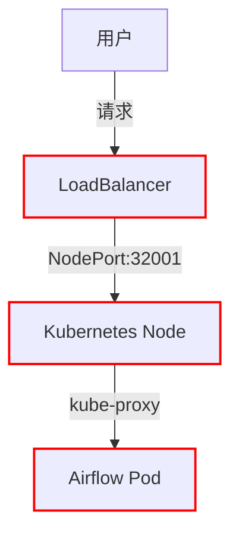
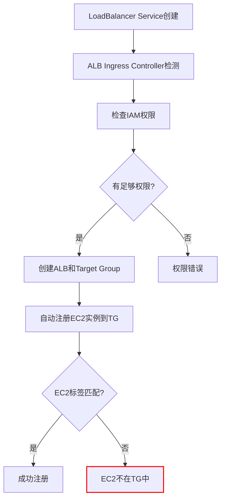

好的，这是一个关于如何为部署在 Kubernetes 上（通过 Helm）的 Airflow 配置 ALB（Application Load Balancer）以限制访问来源的详细说明。

最常见的做法是在 ALB 的 **Ingress 注解 (Annotations)** 中配置安全规则。这里假设您使用的是 AWS ALB 和 AWS EKS，但核心概念也适用于其他云提供商（只需调整注解的键值即可）。

### 核心方法：通过 Ingress Annotations 配置源IP限制

主要使用以下两种注解：

1.  `alb.ingress.kubernetes.io/security-groups`: 手动附加安全组（更传统的方式）
2.  `alb.ingress.kubernetes.io/inbound-cidrs`： **（推荐）** 直接在 Ingress 上设置允许的 CIDR 块列表。这是最直接和云原生的方法。

---

### 详细配置步骤 (Helm Values.yaml)

您需要在 Airflow Helm Chart 的 `values.yaml` 文件中修改 `ingress` 配置部分。

#### 方案一：（推荐）使用 `alb.ingress.kubernetes.io/inbound-cidrs`

此方案直接在 ALB 层面进行IP过滤，效率高且配置简单。

```yaml
# values.yaml
ingress:
  enabled: true
  className: alb # 指定使用 ALB Ingress Controller
  annotations:
    # 核心配置：指定允许的源IP CIDR范围
    alb.ingress.kubernetes.io/inbound-cidrs: <YOUR_OFFICE_IP_CIDR>, <YOUR_VPN_IP_CIDR>
    # 示例: 
    # alb.ingress.kubernetes.io/inbound-cidrs: 192.168.1.0/24, 123.45.67.89/32

    # 其他必要的ALB注解
    kubernetes.io/ingress.class: alb
    alb.ingress.kubernetes.io/scheme: internet-facing # 或 internal
    alb.ingress.kubernetes.io/target-type: ip
    # 如果您使用HTTPS，还需要配置SSL和证书
    alb.ingress.kubernetes.io/listen-ports: '[{"HTTP": 80}, {"HTTPS": 443}]'
    alb.ingress.kubernetes.io/certificate-arn: arn:aws:acm:us-west-2:XXXXXXXXX:certificate/XXXXXX-XXXXXXX-XXXXXXX-XXXXXXXX
    alb.ingress.kubernetes.io/ssl-redirect: '443'

  hosts:
    - host: airflow.your-company.com
      paths:
        - path: /
          pathType: Prefix
```

**工作原理：**
ALB Ingress Controller 会读取 `inbound-cidrs` 注解，并自动在 ALB 的安全策略中创建规则，只允许列出的 CIDR 范围的流量通过。来自其他IP地址的请求将被 ALB **直接拒绝（返回403错误）**，甚至不会到达您的 Airflow Pod。

#### 方案二：使用 `alb.ingress.kubernetes.io/security-groups`

此方案允许您关联一个自定义的、预先配置好的安全组。

1.  **首先，在 AWS 控制台手动创建一个安全组 (Security Group)**。在此安全组的入站规则 (Inbound rules) 中，添加允许访问的源IP和端口（例如，端口 443 的源为 `YOUR_OFFICE_IP/32`）。

2.  **然后，在 Helm Values 中引用该安全组的ID**。

```yaml
# values.yaml
ingress:
  enabled: true
  className: alb
  annotations:
    # 核心配置：附加自定义安全组
    alb.ingress.kubernetes.io/security-groups: sg-xxxxxxxxxxxxx # 替换为你的安全组ID

    # 注意：务必包含ALB Controller自动创建的安全组，否则会导致服务中断
    alb.ingress.kubernetes.io/manage-backend-security-group-rules: 'false'

    # 其他必要的ALB注解
    kubernetes.io/ingress.class: alb
    alb.ingress.kubernetes.io/scheme: internet-facing
    alb.ingress.kubernetes.io/target-type: ip
    alb.ingress.kubernetes.io/listen-ports: '[{"HTTPS": 443}]'
    alb.ingress.kubernetes.io/certificate-arn: arn:aws:acm:...

  hosts:
    - host: airflow.your-company.com
      paths:
        - path: /
          pathType: Prefix
```

**重要提示：** 当使用 `security-groups` 注解时，**必须**设置 `alb.ingress.kubernetes.io/manage-backend-security-group-rules: 'false'`。这是因为 ALB Controller 默认会管理安全组规则以允许流量到达Pod。如果您覆盖了安全组但没有禁用此功能，Controller 会尝试修改您的自定义安全组，可能导致规则冲突。

---

### 部署与验证

1.  **保存配置**：将上述配置更新到您的 `values.yaml` 文件中。
2.  **升级 Helm Release**：
    ```bash
    helm upgrade --install my-airflow apache-airflow/airflow -n airflow -f values.yaml
    ```
3.  **验证**：
    *   运行 `kubectl describe ingress <your-airflow-ingress-name> -n airflow` 命令，检查 Events 部分以及Annotations是否正确应用。
    *   在 AWS EC2 控制台，找到对应的 ALB，查看其安全组或监听器规则，确认IP限制已生效。
    *   **最终测试**：尝试从一个**不在允许列表内**的IP地址（例如，使用手机网络）访问您的 Airflow URL，应该收到一个 `403 Forbidden` 错误。而从允许的IP访问则一切正常。

### 总结

| 特性 | 方案一 (`inbound-cidrs`) | 方案二 (`security-groups`) |
| :--- | :--- | :--- |
| **推荐度** | ⭐⭐⭐⭐⭐ **推荐** | ⭐⭐⭐ |
| **复杂度** | 低（仅需修改YAML） | 中（需手动创建和管理安全组） |
| **灵活性** | 中等（仅支持CIDR规则） | 高（支持安全组的所有高级规则） |
| **管理方式** | 声明式（GitOps友好） | 命令式/手动操作 |

对于大多数场景，**方案一（`inbound-cidrs`）** 是更简单、更直接且更易于维护的选择。只有在需要非常复杂的网络规则时，才考虑使用方案二。


# 如何通过增加节点和参数调优加速Airflow任务处理

当您希望通过增加计算节点(node)来加速Airflow任务处理时，需要调整以下几个关键参数和配置：

## 1. 执行器(Executor)相关配置

### 对于CeleryExecutor:
```ini
[celery]
# 增加worker节点数量
worker_concurrency = 16  # 每个worker节点的任务并发数

# 优化任务队列
worker_prefetch_multiplier = 4  # 每个worker预取任务数
broker_transport_options = {'visibility_timeout': 43200}  # 任务可见性超时
```

### 对于KubernetesExecutor:
```ini
[kubernetes]
# 增加worker pod的并发创建能力
worker_pods_creation_batch_size = 8

# 优化pod配置
worker_container_repository = apache/airflow
worker_container_tag = latest
delete_worker_pods = True  # 任务完成后删除pod
```

## 2. 核心并行度参数

```ini
[core]
# 全局并行任务上限(根据节点数调整)
parallelism = 512  # 总任务槽位数=节点数×每节点并发数

# 单个DAG的并行度
dag_concurrency = 64  # 单个DAG可同时运行的任务数

# 调度器优化
max_threads = 8  # 调度器线程数
scheduler_heartbeat_sec = 5  # 调度器心跳间隔
```

## 3. 资源池(Pool)配置

```ini
# 默认池大小(应小于parallelism)
default_pool_task_slot_count = 256

# 创建专用资源池(通过UI或CLI)
# airflow pools set -s high_cpu_pool 64 "For CPU-intensive tasks"
```

## 4. 动态扩展策略

### 自动扩展配置(Celery):
```bash
# 使用celery auto-scale功能
airflow celery worker --autoscale=10,3  # 最大10个worker，最小3个
```

### Kubernetes集群自动缩放:
```yaml
# 在Kubernetes集群配置HPA(Horizontal Pod Autoscaler)
apiVersion: autoscaling/v2beta2
kind: HorizontalPodAutoscaler
metadata:
  name: airflow-worker
spec:
  scaleTargetRef:
    apiVersion: apps/v1
    kind: Deployment
    name: airflow-worker
  minReplicas: 3
  maxReplicas: 20
  metrics:
  - type: Resource
    resource:
      name: cpu
      target:
        type: Utilization
        averageUtilization: 70
```

## 5. 监控与调优建议

1. **监控指标**:
   - 任务队列长度
   - 节点资源利用率(CPU/内存)
   - 任务执行时间分布

2. **调优步骤**:
   - 先增加节点数量
   - 然后逐步提高parallelism和worker_concurrency
   - 观察系统负载，避免过度配置

3. **DAG优化**:
   ```python
   # 在DAG定义中设置并发参数
   dag = DAG(
       'my_dag',


状态标签	含义	需关注程度	典型优化措施
None	未调度	低	检查 DAG 触发逻辑
Scheduled	已调度未执行	中	增加 Worker 或调整并发
Queued	排队中	高	优化资源池（Pools）或扩容 Worker
Running	运行中	中	监控执行时间，避免卡住
Success	成功	-	无需处理
Failed	失败	高	检查日志，增加重试
Removed	已清除	低	确认是否为预期行为
通过这些状态数字，您可以精准定位 DAG 的执行瓶颈，并采取针对性优化措施。


根据您描述的状态（`Queued: 0-2`，`Scheduled: 50+`，`Running: <10`），系统明显存在 **调度与执行之间的资源错配**。以下是根本原因和针对性优化方案：

---

### 一、核心问题诊断
| 现象                | 直接原因                                                                 | 深层根源                              |
|---------------------|--------------------------------------------------------------------------|---------------------------------------|
| `Scheduled` 积压高  | 调度器能生成任务，但执行器无法领取                                       | 全局并行度或 Worker 资源配置不足       |
| `Running` 过低      | 实际执行的任务数远低于系统能力                                           | Worker 未启动/配置错误/资源阻塞        |
| `Queued` 几乎为零   | 任务未被放入执行队列（可能因 Executor 无响应或槽位不足）                  | 资源池(Pool)或消息队列瓶颈             |

**关键结论**：  
调度器（Scheduler）和 执行器（Executor）之间的管道被阻塞，任务卡在“已调度”状态无法进入“运行”阶段。

---

### 二、优化方案（按优先级排序）

#### ▶ 1. **立即生效的调整**
```ini
# airflow.cfg 关键修改
[core]
parallelism = 200                      # 必须 > (worker_concurrency × worker数量)
dag_concurrency = 100                  # 允许单个DAG更多并行

[celery]  # 如果是CeleryExecutor
worker_concurrency = 20                # 每个Worker的并发槽位（默认16）
worker_prefetch_multiplier = 1         # 避免任务堆积在个别Worker

[scheduler]
max_threads = 8                        # 增加调度器处理线程
min_file_process_interval = 30         # 减少DAG文件解析频率（秒）
```
**操作步骤**：  
1. 修改后重启 **Scheduler** 和 **Worker**  
2. 执行 `airflow pools list` 确认默认池槽位足够（建议 `default_pool` ≥ `parallelism`）

#### ▶ 2. **Worker 资源扩展**
- **CeleryExecutor**：  
  ```bash
  # 启动更多Worker节点（按需扩展）
  airflow celery worker --concurrency=20 -q default_pool -n worker2
  ```
- **KubernetesExecutor**：  
  ```ini
  [kubernetes]
  worker_pods_creation_batch_size = 10  # 增加Pod创建批处理量
  ```

#### ▶ 3. **解除资源阻塞**
- **检查消息队列**（如Redis/RabbitMQ）：  
  ```bash
  # Redis监控
  redis-cli info | grep connected_clients
  # RabbitMQ监控
  rabbitmqctl list_queues name messages_ready
  ```
  如果队列积压，需扩容或优化网络。

- **优化数据库性能**：  
  ```sql
  -- 对PostgreSQL，确保这些参数已调优
  max_connections = 200
  shared_buffers = 4GB
  maintenance_work_mem = 1GB
  ```

#### ▶ 4. **任务级优化**
```python
# 在DAG中设置更高优先级
my_task = PythonOperator(
    task_id="my_task",
    priority_weight=100,  # 默认1，增大以优先执行
    queue='high_priority' # 使用专用队列
)
```
**操作建议**：  
1. 将关键任务分配到独立资源池：  
   ```bash
   airflow pools set -s critical_pool 50 "高优先级任务专用"
   ```  
2. 在Operator中指定池：  
   ```python
   MyOperator(task_id="t1", pool="critical_pool", pool_slots=2)
   ```

---

### 三、验证优化效果
| 指标                | 优化前       | 优化后目标     | 检查方法                     |
|---------------------|--------------|----------------|------------------------------|
| `Running` 任务数    | <10          | ≥ (worker_concurrency × worker数) | `airflow tasks list --state running` |
| `Scheduled` 积压    | 50+          | <10            | Web UI 或 `airflow dags list-jobs` |
| Worker CPU利用率     | 可能很低      | 60%~80%        | `htop` 或 Kubernetes Dashboard |

---

### 四、高级调优（适用于持续高负载场景）
1. **动态并发调整**：  
   ```python
   from airflow.models import Variable
   dynamic_concurrency = Variable.get("target_concurrency", default_var=20)
   ```
2. **基于压力的自动扩展**（Celery+K8s）：  
   ```yaml
   # Kubernetes HPA示例
   metrics:
   - type: External
     external:
       metric:
         name: airflow_queued_tasks
         selector: {matchLabels: {app: airflow-worker}}
       target:
         type: AverageValue
         averageValue: 10
   ```

---

### 五、常见误区避免
1. **盲目增加 `parallelism`**：  
   - 需确保 Worker 实际能承载（如 4个Worker × 20并发 = 80，则 `parallelism` 应设为 100~120）  
2. **忽略任务倾斜**：  
   - 使用 `airflow tasks --tree <dag_id>` 检查是否有任务阻塞整个DAG  
3. **过度降低调度频率**：  
   - `min_file_process_interval` 低于30秒可能导致调度器过载  

通过上述调整，`Running` 任务数应能快速提升至 Worker 的理论并发上限，同时 `Scheduled` 积压会逐步下降。如果问题仍存在，需检查 Executor 日志（`airflow worker --log-file=/logs/worker.log`）定位具体阻塞点。


 # EKS 上使用 Helm 部署 Airflow 并通过 AWS Load Balancer 访问的完整流程

## 1. 整体架构原理



## 2. Helm 配置细节

### Airflow Values.yaml 关键配置
```yaml
# values-airflow.yaml
airflow:
  config:
    AIRFLOW__WEBSERVER__BASE_URL: "http://airflow.example.com"
  
  webserver:
    service:
      type: ClusterIP  # 内部服务，由Ingress暴露
      port: 8080
  
  ingress:
    enabled: true
    web:
      enabled: true
      host: "airflow.example.com"
      path: "/"
      annotations:
        # AWS ALB 特定注解
        kubernetes.io/ingress.class: alb
        alb.ingress.kubernetes.io/scheme: internet-facing
        alb.ingress.kubernetes.io/target-type: ip
        alb.ingress.kubernetes.io/listen-ports: '[{"HTTP": 80}, {"HTTPS": 443}]'
        alb.ingress.kubernetes.io/certificate-arn: arn:aws:acm:us-west-2:123456789012:certificate/xxxxxx
```

## 3. AWS Load Balancer Controller 工作原理

### Ingress 到 ALB 的转换过程
```bash
# 1. Helm 创建 Ingress 资源
kubectl get ingress -n airflow
# NAME      CLASS   HOSTS                 ADDRESS                                                                 PORTS   AGE
# airflow   <none>  airflow.example.com   k8s-airflow-airflow-xxxxxx.us-west-2.elb.amazonaws.com   80      5m

# 2. AWS Load Balancer Controller 检测到 Ingress
# 3. 自动创建 ALB 和 Target Groups
# 4. 注册 EKS 节点/Pod 到 Target Group
```

### 关键注解说明
```yaml
annotations:
  kubernetes.io/ingress.class: alb           # 指定使用 ALB
  alb.ingress.kubernetes.io/scheme: internet-facing  # 公网访问
  alb.ingress.kubernetes.io/target-type: ip  # 直接路由到 Pod IP
  alb.ingress.kubernetes.io/healthcheck-path: /health  # 健康检查路径
  alb.ingress.kubernetes.io/ssl-redirect: 'true'       # HTTP 重定向到 HTTPS
```

## 4. 完整的访问流程

### 步骤详解
1. **DNS 解析**：
   ```bash
   # airflow.example.com DNS 解析到 ALB 的 DNS 名称
   dig airflow.example.com
   # 返回: k8s-airflow-airflow-xxxxxx.us-west-2.elb.amazonaws.com
   ```

2. **ALB 接收请求**：
   - 客户端请求到达 ALB
   - ALB 根据监听器规则路由到相应的 Target Group

3. **Ingress 路由处理**：
   ```yaml
   # Ingress 规则示例
   rules:
   - host: airflow.example.com
     http:
       paths:
       - path: /
         pathType: Prefix
         backend:
           service:
             name: airflow-web
             port:
               number: 8080
   ```

4. **Service 负载均衡**：
   ```bash
   # Service 将流量分发到后端 Pod
   kubectl describe svc airflow-web -n airflow
   # Name:              airflow-web
   # Type:              ClusterIP
   # Port:              http  8080/TCP
   # TargetPort:        8080/TCP
   # Endpoints:         10.0.1.5:8080,10.0.2.3:8080
   ```

5. **Pod 处理请求**：
   - Airflow Web Pod 接收请求
   - 处理用户界面或 API 调用

## 5. 详细配置示例

### 完整的 Helm 安装命令
```bash
# 添加 Airflow Helm 仓库
helm repo add apache-airflow https://airflow.apache.org
helm repo update

# 安装 Airflow
helm install airflow apache-airflow/airflow \
  --namespace airflow \
  --create-namespace \
  --values values-airflow.yaml \
  --set executor=CeleryExecutor \
  --set redis.enabled=true \
  --set postgresql.enabled=false \
  --set externalDatabase.host=airflow-db.cluster-xxxxxx.us-west-2.rds.amazonaws.com \
  --set externalDatabase.database=airflow \
  --set externalDatabase.user=airflow_user
```

### Ingress 资源详情
```yaml
# kubectl get ingress airflow -n airflow -o yaml
apiVersion: networking.k8s.io/v1
kind: Ingress
metadata:
  name: airflow
  namespace: airflow
  annotations:
    kubernetes.io/ingress.class: alb
    alb.ingress.kubernetes.io/scheme: internet-facing
    alb.ingress.kubernetes.io/target-type: ip
    alb.ingress.kubernetes.io/healthcheck-path: /health
    alb.ingress.kubernetes.io/ssl-redirect: 'true'
spec:
  rules:
  - host: airflow.example.com
    http:
      paths:
      - path: /
        pathType: Prefix
        backend:
          service:
            name: airflow-web
            port:
              number: 8080
```

## 6. 监控和验证

### 检查资源状态
```bash
# 查看 Ingress 状态
kubectl get ingress -n airflow

# 查看 ALB 详细信息
aws elbv2 describe-load-balancers --names k8s-airflow-airflow-xxxxxx

# 查看 Target Group 健康状态
aws elbv2 describe-target-health --target-group-arn arn:aws:elasticloadbalancing:us-west-2:123456789012:targetgroup/xxxxxx
```

### 访问测试
```bash
# 测试 ALB 访问
curl -v http://airflow.example.com/health

# 获取 ALB DNS 名称直接访问
ALB_DNS=$(kubectl get ingress airflow -n airflow -o jsonpath='{.status.loadBalancer.ingress[0].hostname}')
curl http://$ALB_DNS/health
```

## 7. 安全考虑

### IAM 角色配置
```yaml
# ServiceAccount 注解用于 IAM 角色
serviceAccount:
  create: true
  annotations:
    eks.amazonaws.com/role-arn: arn:aws:iam::123456789012:role/airflow-alb-role
```

### 网络安全
```yaml
# Network Policy 限制流量
networkPolicy:
  enabled: true
  ingress:
    from:
    - namespaceSelector:
        matchLabels:
          name: ingress-nginx
    ports:
    - protocol: TCP
      port: 8080
```

这种配置提供了高度可扩展的 Airflow 部署，通过 AWS ALB 提供可靠的对外访问能力，同时保持了 Kubernetes 原生的工作负载管理优势。


       max_active_runs=5,  # 控制同时运行的DAG实例数
       concurrency=20,     # 本DAG的并发任务数
   )
   ```

通过合理配置这些参数，配合增加的节点资源，可以显著提高Airflow的任务处理速度。建议每次调整后监控系统表现，逐步找到最优配置。


# AWS ALB Ingress 到 Service 的详细工作机制

## 1. 核心架构解析



## 2. Service Endpoint 显示为 LoadBalancer 的原因

### 实际工作流程
```bash
# 查看 Service 详情 - 类型为 ClusterIP
kubectl get svc airflow-web -n airflow
# NAME          TYPE        CLUSTER-IP     EXTERNAL-IP   PORT(S)    AGE
# airflow-web   ClusterIP   10.100.50.12   <none>        8080/TCP   5d

# 查看 Ingress 详情 - 这里显示 LoadBalancer 地址
kubectl get ingress airflow -n airflow
# NAME      CLASS   HOSTS                 ADDRESS                                                                  PORTS   AGE
# airflow   <none>  airflow.example.com   k8s-airflow-airflow-xxxxxx.us-west-2.elb.amazonaws.com   80      5d
```

**关键理解**：`EXTERNAL-IP` 显示在 Ingress 资源上，而不是 Service 上。Service 保持 `ClusterIP` 类型，由 Ingress 负责对外暴露。

## 3. ALB 到 Ingress 的路由机制

### 路由规则配置位置
```yaml
# Ingress 资源中的路由规则
apiVersion: networking.k8s.io/v1
kind: Ingress
metadata:
  name: airflow
  namespace: airflow
  annotations:
    # ALB 控制注解
    kubernetes.io/ingress.class: alb
    alb.ingress.kubernetes.io/target-type: ip  # 关键配置：直接指向Pod
spec:
  rules:
  - host: airflow.example.com
    http:
      paths:
      - path: /
        pathType: Prefix
        backend:
          service:
            name: airflow-web    # 引用的Service名称
            port:
              number: 8080       # Service端口
```

### ALB Ingress Controller 的工作流程
1. **监控 Ingress 资源**：Controller 监控集群中的 Ingress 变化
2. **解析注解**：读取 `kubernetes.io/ingress.class: alb` 注解
3. **创建 ALB**：通过 AWS API 创建 Application Load Balancer
4. **配置监听器**：设置 HTTP/HTTPS 监听器
5. **创建目标组**：为每个后端 Service 创建 Target Group
6. **注册目标**：将 Pod IP 直接注册到 Target Group（IP模式）

## 4. Target Group 显示 EC2 端口异常但访问正常的原因

### IP 模式 vs Instance 模式
```yaml
# 两种目标类型对比
alb.ingress.kubernetes.io/target-type: ip      # 直接使用Pod IP和端口
alb.ingress.kubernetes.io/target-type: instance # 使用Node IP和NodePort
```

### IP 模式的工作原理
```bash
# 在 IP 模式下：
# - Target Group 中显示的是 Pod IP（如 10.0.1.5:8080）
# - 健康检查直接发送到 Pod，绕过 kube-proxy
# - 即使 EC2 节点端口显示异常，只要 Pod 健康就能访问

# 查看 Pod IP
kubectl get pods -n airflow -o wide
# NAME                          READY   STATUS    IP           NODE
# airflow-web-5f8c6d98f-abc12   1/1     Running   10.0.1.5     ip-10-0-1-10.ec2.internal

# Target Group 中注册的目标：10.0.1.5:8080（Pod IP + 容器端口）
```

### 网络流量路径
```
用户请求 → ALB → Target Group(Pod IP:8080) → Pod(10.0.1.5:8080) → 容器
```

## 5. 完整的路由规则设置

### 多路径路由示例
```yaml
apiVersion: networking.k8s.io/v1
kind: Ingress
metadata:
  name: airflow
  namespace: airflow
  annotations:
    kubernetes.io/ingress.class: alb
    alb.ingress.kubernetes.io/scheme: internet-facing
    alb.ingress.kubernetes.io/target-type: ip
    alb.ingress.kubernetes.io/actions.ssl-redirect: '{"type": "redirect", "redirectConfig": { "protocol": "HTTPS", "port": "443", "statusCode": "HTTP_301"}}'
spec:
  rules:
  - host: airflow.example.com
    http:
      paths:
      - path: /health
        pathType: Exact
        backend:
          service:
            name: airflow-web
            port:
              number: 8080
      - path: /api/*
        pathType: Prefix
        backend:
          service:
            name: airflow-web
            port:
              number: 8080
      - path: /*
        pathType: Prefix
        backend:
          service:
            name: airflow-web
            port:
              number: 8080
```

## 6. 故障排查命令

### 检查网络连通性
```bash
# 查看 ALB 状态
aws elbv2 describe-load-balancers --names k8s-airflow-airflow-xxxxxx

# 查看 Target Group 健康状态
TARGET_GROUP_ARN=$(aws elbv2 describe-target-groups --names k8s-airflow-airflow-xxxxxx --query 'TargetGroups[0].TargetGroupArn' --output text)
aws elbv2 describe-target-health --target-group-arn $TARGET_GROUP_ARN

# 查看 Pod 网络状态
kubectl get pods -n airflow -o wide
kubectl describe pod airflow-web-abc123 -n airflow

# 检查网络策略
kubectl get networkpolicies -n airflow
```

### 验证服务发现
```bash
# 检查 Endpoints
kubectl get endpoints airflow-web -n airflow
# NAME          ENDPOINTS                   AGE
# airflow-web   10.0.1.5:8080,10.0.2.3:8080   5d

# 测试内部访问
kubectl exec -n airflow deployment/airflow-web -- curl -I http://10.0.1.5:8080/health
```

## 7. 关键配置验证点

1. **注解正确性**：确保 `kubernetes.io/ingress.class: alb`
2. **目标类型**：`alb.ingress.kubernetes.io/target-type: ip`
3. **服务发现**：Endpoints 应该显示正确的 Pod IP
4. **网络策略**：确保没有 NetworkPolicy 阻塞流量
5. **安全组**：Node 安全组允许 Pod 间通信

这种架构的优势在于：**ALB 直接与 Pod 通信**，避免了额外的网络跳转，即使 EC2 节点的某些端口显示异常，只要 Pod 网络正常，服务就能正常工作。


您观察到的现象非常关键！这确实是一个重要的细节。让我详细解释当 Service 类型设置为 `LoadBalancer` 时的工作机制。

## 1. 两种不同的架构模式

### 模式A: Ingress + ClusterIP Service（常见）
```yaml
# Service 类型为 ClusterIP
kind: Service
type: ClusterIP
---
# 由 Ingress 处理外部流量
kind: Ingress
```

### 模式B: LoadBalancer Service（您的配置）
```yaml
# Service 直接暴露为 LoadBalancer
kind: Service
type: LoadBalancer
```

## 2. LoadBalancer Service 的详细工作机制

### Service 配置示例
```yaml
apiVersion: v1
kind: Service
metadata:
  name: airflow-web
  namespace: airflow
  annotations:
    service.beta.kubernetes.io/aws-load-balancer-type: "nlb"  # 或 "alb"
    service.beta.kubernetes.io/aws-load-balancer-scheme: "internet-facing"
spec:
  type: LoadBalancer  # 关键配置
  ports:
  - port: 80
    targetPort: 8080
    protocol: TCP
  selector:
    app: airflow-web
```

### 工作流程


## 3. 为什么 Target Groups 显示 EC2 端口异常但访问正常

### NodePort 机制
```bash
# 查看 Service 详情
kubectl describe svc airflow-web -n airflow
# Name:                     airflow-web
# Type:                     LoadBalancer
# IP:                       10.100.50.12
# LoadBalancer Ingress:     xxxxxx.elb.amazonaws.com
# Port:                     http  80/TCP
# TargetPort:               8080/TCP
# NodePort:                 http  32001/TCP  # 自动分配的节点端口
# Endpoints:                10.0.1.5:8080,10.0.2.3:8080
```

### 实际流量路径
```
用户请求 → AWS Load Balancer → NodeIP:32001 → kube-proxy → PodIP:8080
```

### 健康检查机制
```yaml
# AWS 自动配置的健康检查
healthCheck:
  protocol: HTTP
  port: traffic-port    # 使用 NodePort 32001
  path: /health
  interval: 30s
  timeout: 5s
  healthyThreshold: 2
  unhealthyThreshold: 2
```

**关键理解**：健康检查发送到 `NodeIP:NodePort`，但实际业务流量最终到达 `PodIP:TargetPort`。

## 4. 在这种模式下 Ingress 的角色

### 可能的配置场景
```yaml
# 场景1: Service 直接暴露，没有 Ingress
# 只有 LoadBalancer Service，没有 Ingress 资源

# 场景2: Service 暴露，Ingress 用于高级路由
apiVersion: networking.k8s.io/v1
kind: Ingress
metadata:
  name: airflow-ingress
  annotations:
    # 即使 Service 是 LoadBalancer，Ingress 仍可提供高级路由
    kubernetes.io/ingress.class: alb
spec:
  rules:
  - host: airflow.example.com  # 基于主机名的路由
    http:
      paths:
      - path: /
        backend:
          service:
            name: airflow-web  # 指向 LoadBalancer Service
            port:
              number: 80
```

## 5. 访问流程详解

### 完整访问路径


## 6. 验证和排查命令

### 检查当前配置
```bash
# 查看 Service 类型和配置
kubectl get svc -n airflow -o wide
kubectl describe svc airflow-web -n airflow

# 查看 Ingress 配置（如果存在）
kubectl get ingress -n airflow
kubectl describe ingress airflow -n airflow

# 查看 Endpoints
kubectl get endpoints airflow-web -n airflow

# 查看 NodePort 分配
kubectl get nodes -o wide
```

### 网络连通性测试
```bash
# 测试从外部访问
curl -v http://airflow.example.com/health

# 测试内部访问（绕过 LoadBalancer）
kubectl exec -n airflow deployment/airflow-web -- curl -I http://10.0.1.5:8080/health

# 检查 NodePort 访问
NODE_IP=$(kubectl get node -o jsonpath='{.items[0].status.addresses[0].address}')
NODE_PORT=$(kubectl get svc airflow-web -n airflow -o jsonpath='{.spec.ports[0].nodePort}')
curl http://$NODE_IP:$NODE_PORT/health
```

## 7. 这种架构的优势和考虑

### 优势
1. **简化架构**：不需要单独的 Ingress Controller
2. **直接控制**：Service 直接管理负载均衡器
3. **性能**：减少网络跳转

### 考虑因素
1. **成本**：每个 LoadBalancer Service 都会创建独立的 ALB/NLB
2. **灵活性**：路由功能不如 Ingress 丰富
3. **管理**：多个 Service 意味着多个负载均衡器

您的配置是有效的，只是采用了不同的暴露模式。这种模式下，Service 自己处理外部流量，而 Ingress（如果存在）可能用于提供额外的路由功能或已经被弃用。


# LoadBalancer Service 504 错误排查指南

## 1. 系统架构和问题定位



## 2. 系统化排查流程

### 第一步：确认基础信息
```bash
# 获取 Service 详细信息
kubectl describe svc airflow-web -n airflow

# 查看完整输出
kubectl get svc airflow-web -n airflow -o yaml

# 检查相关 Pods
kubectl get pods -n airflow -o wide --show-labels
```

### 第二步：网络连通性测试

#### 从外部测试
```bash
# 获取 LoadBalancer DNS
LB_DNS=$(kubectl get svc airflow-web -n airflow -o jsonpath='{.status.loadBalancer.ingress[0].hostname}')

# 测试连接性
curl -v http://$LB_DNS
curl -kv https://$LB_DNS  # 如果是 HTTPS

# 测试具体端口
curl -v http://$LB_DNS:80
```

#### 从集群内部测试
```bash
# 获取 ClusterIP
CLUSTER_IP=$(kubectl get svc airflow-web -n airflow -o jsonpath='{.spec.clusterIP}')

# 从其他 Pod 测试
kubectl run test-pod --image=curlimages/curl --rm -it -- curl -v http://$CLUSTER_IP:8080/health

# 直接测试 Pod IP
POD_IP=$(kubectl get pods -n airflow -l app=airflow-web -o jsonpath='{.items[0].status.podIP}')
kubectl run test-pod --image=curlimages/curl --rm -it -- curl -v http://$POD_IP:8080/health
```

### 第三步：详细检查网络配置

#### 检查 Endpoints
```bash
# 查看 Service 的 Endpoints
kubectl get endpoints airflow-web -n airflow

# 详细查看 Endpoints 配置
kubectl describe endpoints airflow-web -n airflow

# 如果没有 Endpoints，说明 selector 不匹配
kubectl get pods -n airflow --show-labels
kubectl describe svc airflow-web -n airflow | grep Selector
```

#### 检查网络策略
```bash
# 查看 NetworkPolicies
kubectl get networkpolicies -n airflow

# 如果有 NetworkPolicy，检查规则
kubectl describe networkpolicy <policy-name> -n airflow

# 临时禁用 NetworkPolicy 测试
kubectl scale deployment -n airflow <network-policy-controller> --replicas=0
```

### 第四步：AWS 负载均衡器诊断

#### 检查 Load Balancer 状态
```bash
# 获取 Load Balancer ARN
LB_ARN=$(aws elbv2 describe-load-balancers --names <load-balancer-name> --query 'LoadBalancers[0].LoadBalancerArn' --output text)

# 检查 Load Balancer 状态
aws elbv2 describe-load-balancers --load-balancer-arns $LB_ARN

# 检查监听器
aws elbv2 describe-listeners --load-balancer-arn $LB_ARN
```

#### 检查 Target Group 和健康检查
```bash
# 获取 Target Groups
TARGET_GROUP_ARN=$(aws elbv2 describe-target-groups --load-balancer-arn $LB_ARN --query 'TargetGroups[0].TargetGroupArn' --output text)

# 检查目标健康状态
aws elbv2 describe-target-health --target-group-arn $TARGET_GROUP_ARN

# 检查健康检查配置
aws elbv2 describe-target-group-attributes --target-group-arn $TARGET_GROUP_ARN

# 手动注册测试目标
INSTANCE_ID=$(curl -s http://169.254.169.254/latest/meta-data/instance-id)
aws elbv2 register-targets --target-group-arn $TARGET_GROUP_ARN --targets Id=$INSTANCE_ID,Port=32001
```

### 第五步：深入排查 504 错误

#### 检查超时配置
```bash
# 查看 Service 注解中的超时设置
kubectl describe svc airflow-web -n airflow | grep -i timeout
kubectl describe svc airflow-web -n airflow | grep -i idle

# 检查 AWS 负载均衡器属性
aws elbv2 describe-load-balancer-attributes --load-balancer-arn $LB_ARN
```

#### 检查应用响应时间
```bash
# 直接测试 Pod 响应时间
POD_IP=$(kubectl get pods -n airflow -l app=airflow-web -o jsonpath='{.items[0].status.podIP}')
time curl -o /dev/null -s -w "%{time_total}\n" http://$POD_IP:8080/health

# 在 Pod 内部测试
kubectl exec -n airflow deployment/airflow-web -- timeout 30 curl -s http://localhost:8080/health
```

### 第六步：安全组和网络ACL检查

#### 检查安全组规则
```bash
# 获取安全组 ID
SG_ID=$(aws ec2 describe-security-groups --filters Name=group-name,Values=*airflow* --query 'SecurityGroups[0].GroupId' --output text)

# 检查安全组规则
aws ec2 describe-security-groups --group-ids $SG_ID

# 检查网络 ACL
VPC_ID=$(aws ec2 describe-security-groups --group-ids $SG_ID --query 'SecurityGroups[0].VpcId' --output text)
aws ec2 describe-network-acls --filters Name=vpc-id,Values=$VPC_ID Name=tag:Name,Values=*airflow*
```

## 3. 常见问题解决方案

### 问题1: Endpoints 为空
```bash
# 检查 Pod selector 匹配
kubectl get pods -n airflow --show-labels
kubectl describe svc airflow-web -n airflow | grep Selector

# 修复 selector 不匹配
kubectl patch svc airflow-web -n airflow -p '{"spec":{"selector":{"app":"airflow-web"}}}'
```

### 问题2: 健康检查失败
```yaml
# 在 Service 注解中调整健康检查
annotations:
  service.beta.kubernetes.io/aws-load-balancer-healthcheck-path: /health
  service.beta.kubernetes.io/aws-load-balancer-healthcheck-interval: "30"
  service.beta.kubernetes.io/aws-load-balancer-healthcheck-timeout: "5"
  service.beta.kubernetes.io/aws-load-balancer-healthcheck-healthy-threshold: "2"
  service.beta.kubernetes.io/aws-load-balancer-healthcheck-unhealthy-threshold: "2"
```

### 问题3: 网络策略阻塞
```bash
# 临时允许所有流量测试
kubectl apply -n airflow -f - <<EOF
apiVersion: networking.k8s.io/v1
kind: NetworkPolicy
metadata:
  name: allow-all-test
spec:
  podSelector: {}
  ingress:
  - {}
  egress:
  - {}
EOF
```

## 4. 最终验证

```bash
# 完整的端到端测试
LB_DNS=$(kubectl get svc airflow-web -n airflow -o jsonpath='{.status.loadBalancer.ingress[0].hostname}')
echo "Testing LoadBalancer: $LB_DNS"

# 测试连接
for i in {1..5}; do
    echo "Attempt $i:"
    curl -v --connect-timeout 10 --max-time 30 http://$LB_DNS/health
    echo ""
    sleep 2
done
```

按照这个系统化的排查流程，您应该能够定位并解决 504 错误。重点关注 Endpoints、健康检查、网络策略和 AWS 负载均衡器配置。


# Target Group 不能自动挂载 EC2 的问题排查

这个问题非常典型，通常是由于 AWS Load Balancer Controller 的配置或权限问题导致的。让我详细解释原因和解决方案。

## 1. 问题根本原因分析



## 2. 详细排查步骤

### 第一步：检查 IAM 权限
```bash
# 查看 ALB Controller 的 ServiceAccount
kubectl describe serviceaccount aws-load-balancer-controller -n kube-system

# 查看 IAM 角色
kubectl describe pod <alb-controller-pod> -n kube-system | grep AWS_ROLE_ARN

# 检查 IAM 策略是否包含这些权限
REQUIRED_PERMISSIONS=(
    "elasticloadbalancing:RegisterTargets"
    "elasticloadbalancing:DeregisterTargets"
    "elasticloadbalancing:DescribeTargetGroups"
    "ec2:DescribeInstances"
    "ec2:DescribeTags"
)
```

### 第二步：检查 ALB Controller 日志
```bash
# 查看 ALB Controller 日志
kubectl logs -n kube-system deployment/aws-load-balancer-controller

# 查看详细日志（可能有错误信息）
kubectl logs -n kube-system deployment/aws-load-balancer-controller | grep -i "target\|register\|ec2"

# 常见错误示例：
# "failed to register targets" 
# "permission denied"
# "no instances found"
```

### 第三步：检查 EC2 标签
```bash
# 查看 EC2 实例标签
INSTANCE_ID=$(curl -s http://169.254.169.254/latest/meta-data/instance-id)
aws ec2 describe-tags --filters Name=resource-id,Values=$INSTANCE_ID

# 必需的集群标签：
# - kubernetes.io/cluster/<cluster-name>: owned 或 shared
# - alpha.eksctl.io/cluster-name: <cluster-name> （如果使用eksctl）
```

### 第四步：检查 Target Group 属性
```bash
# 获取 Target Group ARN
TG_ARN=$(aws elbv2 describe-target-groups --names <target-group-name> --query 'TargetGroups[0].TargetGroupArn' --output text)

# 查看 Target Group 属性
aws elbv2 describe-target-group-attributes --target-group-arn $TG_ARN

# 检查 target_type 应该是 instance 而不是 ip
aws elbv2 describe-target-groups --target-group-arns $TG_ARN --query 'TargetGroups[0].TargetType'
```

## 3. 根本原因和解决方案

### 原因1: IAM 权限不足
```yaml
# 必需的 IAM 策略
{
    "Effect": "Allow",
    "Action": [
        "elasticloadbalancing:RegisterTargets",
        "elasticloadbalancing:DeregisterTargets",
        "elasticloadbalancing:DescribeTargetGroups",
        "ec2:DescribeInstances",
        "ec2:DescribeTags"
    ],
    "Resource": "*"
}
```

**解决方案**：
```bash
# 更新 IAM 角色策略
aws iam attach-role-policy \
    --role-name <alb-controller-role> \
    --policy-arn arn:aws:iam::aws:policy/ElasticLoadBalancingFullAccess

# 或者使用更精细的策略
```

### 原因2: EC2 实例标签缺失或不正确
**必需的标签**：
```bash
# 集群标识标签
aws ec2 create-tags \
    --resources $INSTANCE_ID \
    --tags Key=kubernetes.io/cluster/<cluster-name>,Value=owned

# 节点角色标签
aws ec2 create-tags \
    --resources $INSTANCE_ID \
    --tags Key=kubernetes.io/role/node,Value=1
```

### 原因3: ALB Controller 配置错误
```yaml
# 检查 ALB Controller 启动参数
kubectl describe deployment aws-load-balancer-controller -n kube-system

# 应该包含正确的集群名称
args:
- --cluster-name=<your-cluster-name>
- --aws-vpc-id=vpc-xxxxxx
- --aws-region=us-west-2
```

### 原因4: Service 注解配置问题
```yaml
# 错误的配置（使用 IP 模式）
service.beta.kubernetes.io/aws-load-balancer-target-type: ip

# 正确的配置（使用 instance 模式）
service.beta.kubernetes.io/aws-load-balancer-target-type: instance
```

## 4. 验证和修复

### 验证当前状态
```bash
# 查看 Target Group 中的注册目标
aws elbv2 describe-target-health --target-group-arn $TG_ARN

# 查看 EC2 实例状态
aws ec2 describe-instances --instance-ids $INSTANCE_ID

# 检查网络连接
aws ec2 describe-instances --instance-ids $INSTANCE_ID --query 'Reservations[0].Instances[0].NetworkInterfaces[0].Groups'
```

### 修复步骤
```bash
# 1. 更新 IAM 权限
# 2. 添加正确的 EC2 标签
# 3. 重启 ALB Controller
kubectl rollout restart deployment aws-load-balancer-controller -n kube-system

# 4. 验证修复
sleep 30  # 等待控制器重启
aws elbv2 describe-target-health --target-group-arn $TG_ARN
```

## 5. 预防措施

### 使用 eksctl 的正确配置
```yaml
# eksctl 配置文件中确保包含
iam:
  withOIDC: true
  serviceAccounts:
  - namespace: kube-system
    name: aws-load-balancer-controller
    attachPolicyARNs:
    - arn:aws:iam::aws:policy/AWSLoadBalancerControllerIAMPolicy
```

### 定期检查脚本
```bash
#!/bin/bash
# check-alb-targets.sh
CLUSTER_NAME="your-cluster"
TG_ARN=$(aws elbv2 describe-target-groups --query "TargetGroups[?contains(TargetGroupName,'$CLUSTER_NAME')].TargetGroupArn" --output text)

echo "Target Group Health:"
aws elbv2 describe-target-health --target-group-arn $TG_ARN

echo "EC2 Instance Tags:"
INSTANCE_ID=$(curl -s http://169.254.169.254/latest/meta-data/instance-id)
aws ec2 describe-tags --filters Name=resource-id,Values=$INSTANCE_ID
```

## 6. 高级调试

### 启用 ALB Controller 调试日志
```yaml
# 编辑 ALB Controller deployment
kubectl edit deployment aws-load-balancer-controller -n kube-system

# 添加日志级别参数
args:
- --log-level=debug
- --cluster-name=<cluster-name>
```

### 手动触发重新同步
```bash
# 强制 ALB Controller 重新同步
kubectl patch service airflow-web -n airflow -p '{"metadata":{"annotations":{"force-sync":"'$(date +%s)'"}}}'
```

这个问题通常通过修复 IAM 权限和 EC2 标签来解决。确保您的 AWS Load Balancer Controller 有足够的权限来管理 Target Group 注册。


