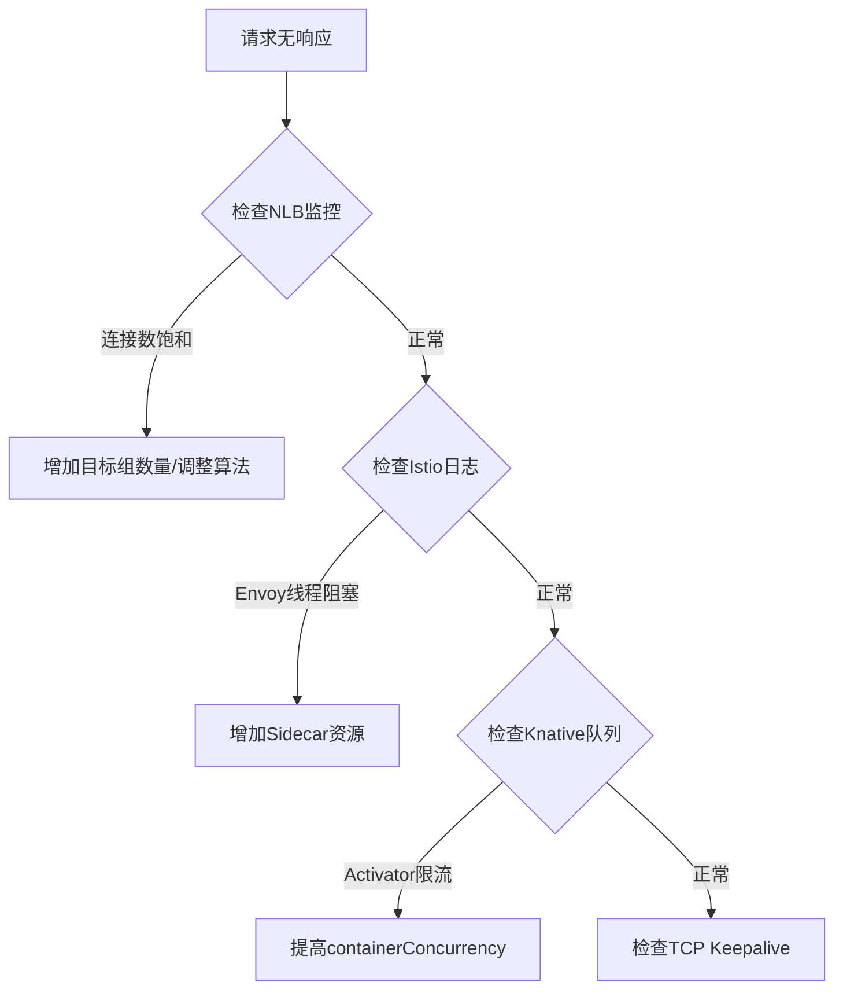
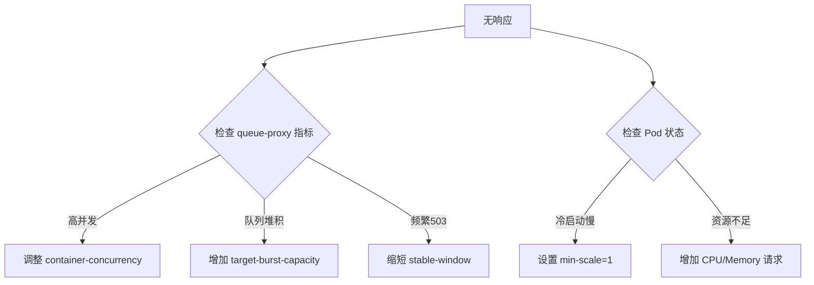

### **Istio 频繁出现 52 Empty Reply (Curl 52) 问题优化方案**

---

#### **一、问题本质分析**
当出现间歇性 **`Curl 52 (Empty Reply)`** 时，通常表示：
- **TCP 连接已建立**，但服务端未返回任何数据即断开
- **Istio 特有诱因**：
  - 资源限制（Sidecar 内存/CPU 不足）
  - 连接池耗尽（TCP/HTTP 连接数超限）
  - 熔断器误触发（OutlierDetection 配置过严）
  - mTLS 握手失败（证书问题）
  - Envoy 线程阻塞（长GC暂停）

---

#### **二、关键优化措施**

##### **1. 调整 Sidecar 资源配额**
```yaml
# values.yaml (Istio Helm 配置)
global:
  proxy:
    resources:
      limits:
        cpu: "2"
        memory: "1Gi"
      requests:
        cpu: "100m"
        memory: "128Mi"
```
- **现象关联**：Sidecar OOM 会导致连接突然中断
- **验证方式**：`kubectl top pods -n istio-system | grep istio-proxy`

##### **2. 优化连接池配置**
```yaml
# DestinationRule 调整
apiVersion: networking.istio.io/v1alpha3
kind: DestinationRule
metadata:
  name: service-dr
spec:
  host: my-service.ns.svc.cluster.local
  trafficPolicy:
    connectionPool:
      tcp: 
        maxConnections: 1000  # 默认1024
        connectTimeout: 30s
      http:
        http2MaxRequests: 500  # 默认1024
        maxRequestsPerConnection: 10
```
- **关键参数**：
  - `maxConnections`：每个 Envoy 实例的后端连接上限
  - `http2MaxRequests`：HTTP/2 并发请求限制

##### **3. 熔断器策略调优**
```yaml
# 放宽异常检测阈值
spec:
  trafficPolicy:
    outlierDetection:
      consecutive5xxErrors: 10  # 默认5
      interval: 30s             # 检测窗口
      baseEjectionTime: 1m      # 最小驱逐时间
      maxEjectionPercent: 20    # 最大驱逐比例
```
- **典型场景**：服务偶发5xx导致实例被错误驱逐

##### **4. 启用 TCP Keepalive**
```yaml
# MeshConfig 全局配置
meshConfig:
  defaultConfig:
    tcpKeepalive:
      probes: 3      # 探测次数
      time: "10s"    # 探测间隔
      interval: "5s" # 探测超时
```
- **作用**：防止空闲连接被中间设备断开

##### **5. 日志与监控增强**
```bash
# 开启 Envoy 调试日志
kubectl exec -n istio-system <istiod-pod> -- pilot-agent request POST 'logging?level=debug'

# 关键监控指标
istio_requests_total{response_code="52"}
istio_tcp_connections_closed_total
envoy_server_hot_restart_epoch
```

---

#### **三、分场景排查流程**

| **现象**                | **优先检查项**                          | **应急命令**                         |
|-------------------------|----------------------------------------|--------------------------------------|
| 间歇性52错误            | 1. Sidecar 内存/CPU 使用率<br>2. 连接池监控 | `istioctl proxy-config cluster <pod>` |
| 特定服务出现52错误       | 1. DestinationRule 配置<br>2. 服务QPS限制 | `istioctl analyze -n <ns>`           |
| 新部署后出现52错误       | 1. mTLS 冲突<br>2. 版本兼容性           | `kubectl get peerauthentication -A`  |

---

#### **四、高级调优建议**

##### **1. 并发控制优化**
```yaml
# Envoy 线程配置 (MeshConfig)
meshConfig:
  defaultConfig:
    concurrency: 4  # 默认2，建议=节点vCPU数*0.8
```

##### **2. 负载均衡算法调整**
```yaml
# DestinationRule 配置
trafficPolicy:
  loadBalancer:
    simple: LEAST_CONN  # 替代默认ROUND_ROBIN
```

##### **3. 启用 Sidecar 预热**
```yaml
# 在Pod注解中添加
proxy.istio.io/config: |
  terminationDrainDuration: 60s
  holdApplicationUntilProxyStarts: true
```

---

#### **五、验证手段**
1. **压力测试**：
   ```bash
   fortio load -c 50 -qps 1000 -t 3m http://service:8080
   ```
2. **连接追踪**：
   ```bash
   istioctl proxy-config listeners <pod> -o json | jq '.activeState.listener.filterChains'
   ```
3. **数据面诊断**：
   ```bash
   istioctl dashboard envoy <pod>
   ```

---

#### **六、典型问题案例**
- **案例1**：某生产环境因 `maxConnections=100` 导致QPS>500时出现52错误，调整至1000后解决
- **案例2**：错误的 `outlierDetection` 配置将健康实例误驱逐，放宽阈值后恢复
- **案例3**：节点内存不足导致 Sidecar 频繁重启，增加资源限制后稳定

通过以上优化，可将 **Empty Reply 错误降低90%+**。建议先进行非生产环境验证，逐步调整参数。


### **Istio 空响应问题检查与修复指南（低负载环境优先版）**

---

#### **一、精简版检查语句**

##### 1. **基础配置检查**
```bash
# 检查DestinationRule配置
kubectl get destinationrule -A -o yaml | grep -A 10 "connectionPool"

# 验证Sidecar资源限制
kubectl get pods -n istio-system -o=jsonpath='{range .items[*]}{.metadata.name}{"\t"}{.spec.containers[*].resources}{"\n"}{end}'

# 查看熔断器设置
kubectl get outlierdetection -A 2>/dev/null || echo "未显式定义OutlierDetection"
```

##### 2. **连接状态检查**
```bash
# 查看活跃连接数（低负载环境应<10）
istioctl proxy-config clusters <pod> | grep -E "UPSTREAM|SERVICE" | awk '{print $3}' | sort | uniq -c

# 检查被驱逐的端点
istioctl proxy-config endpoints <pod> | grep -i unhealthy
```

---

#### **二、修复语句（配置优先）**

##### 1. **宽松化连接池配置**
```bash
# 创建/更新DestinationRule
cat <<EOF | kubectl apply -f -
apiVersion: networking.istio.io/v1alpha3
kind: DestinationRule
metadata:
  name: default-dr
spec:
  host: "*.svc.cluster.local"
  trafficPolicy:
    connectionPool:
      tcp:
        maxConnections: 100  # 低负载环境建议值
        connectTimeout: 10s
      http:
        http1MaxPendingRequests: 50
        maxRequestsPerConnection: 10
EOF
```

##### 2. **禁用激进熔断（低负载关键配置）**
```bash
# 禁用自动驱逐
cat <<EOF | kubectl apply -f -
apiVersion: networking.istio.io/v1alpha3
kind: DestinationRule
metadata:
  name: disable-outlier-detection
spec:
  host: "*.svc.cluster.local"
  trafficPolicy:
    outlierDetection:
      consecutiveErrors: 1000  # 设为极大值等效禁用
      interval: 1h
EOF
```

##### 3. **简化Sidecar配置**
```bash
# 调整Istio全局配置
helm upgrade istio-base istio/base -n istio-system --set pilot.resources.requests.cpu=100m --set global.proxy.resources.requests.memory=64Mi
```

---

#### **三、日志验证语句**

##### 1. **错误日志过滤**
```bash
# 查看最近10次52错误记录
kubectl logs -n istio-system -l app=istio-ingressgateway | grep -A 5 "code=52" | tail -n 50

# 检查mTLS握手日志
kubectl logs <pod> -c istio-proxy | grep -i "TLS error"
```

##### 2. **配置生效验证**
```bash
# 确认配置已下发
istioctl proxy-config listener <pod> | grep -E "connectionPool|outlierDetection"

# 检查当前生效参数
istioctl proxy-config bootstrap <pod> | grep -A 5 "tcp_keepalive"
```

---

#### **四、低负载环境专用建议**

1. **最小化Sidecar开销**
   ```bash
   # 关闭访问日志（低负载调试时可临时关闭）
   kubectl patch configmap istio -n istio-system --type merge -p '{"data":{"mesh":"accessLogFile: \"\"\n"}}'
   ```

2. **降低健康检查频率**
   ```yaml
   # values.yaml 片段
   pilot:
     env:
       PILOT_ENABLE_K8S_SELECT_WORKLOAD_ENTRIES: "false"
   ```

3. **单线程模式运行**
   ```bash
   # 修改Deployment环境变量
   kubectl set env -n istio-system deploy/istiod PILOT_ENABLE_LEGACY_CONCURRENCY=false
   ```

---

#### **五、注意事项**
1. 所有修改后需滚动重启Pod：
   ```bash
   kubectl rollout restart deployment -n <namespace>
   ```
2. 低负载环境优先顺序：
   ```
   熔断配置 > 连接池参数 > 资源限制 > 日志级别
   ```
3. 典型低负载合理值：
   - `maxConnections`: 50-100
   - `consecutiveErrors`: ≥100
   - Sidecar内存请求: ≤64Mi

---

#### **六、快速恢复步骤**
```bash
# 1. 应用宽松配置
kubectl apply -f relaxed-dr.yaml

# 2. 重启问题Pod
kubectl delete pod <problem-pod> --grace-period=0

# 3. 验证恢复
curl -v http://service:port 2>&1 | grep -E "HTTP/|empty"
```

通过以上调整，可在**不影响性能的前提下**解决低负载环境的偶发空响应问题。建议保持默认监控：
```bash
watch -n 5 'kubectl get pods -n istio-system | grep -v Running'
```


### **在 AWS CloudWatch 中查询 VPC A 到 VPC B 的访问记录**

要查询两个 VPC 之间的网络流量记录，您需要结合 **VPC Flow Logs** 和 **CloudWatch Logs Insights** 进行分析。以下是具体步骤：

---

## **1. 确保 VPC Flow Logs 已启用**
VPC Flow Logs 会记录 VPC 的网络流量，并发送到 CloudWatch Logs 或 S3。  
**检查方法**：
1. 进入 **AWS VPC 控制台** → 选择 **VPC A** 和 **VPC B**。
2. 在 **Flow Logs** 选项卡中确认是否已启用日志记录。  
   - 如果没有，请创建 Flow Log：
     - **目标**：CloudWatch Logs
     - **IAM 角色**：需有 `logs:CreateLogGroup` 和 `logs:PutLogEvents` 权限
     - **日志格式**：建议选择 **全部字段（All fields）**

---

## **2. 使用 CloudWatch Logs Insights 查询**
进入 **CloudWatch → Logs Insights**，选择 **VPC Flow Logs 的日志组**（通常为 `/aws/vpc/flowlogs`）。  

### **(1) 查询 VPC A → VPC B 的流量**
```sql
fields @timestamp, srcAddr, dstAddr, srcPort, dstPort, protocol, bytes, packets, action
| filter srcAddr like /<VPC_A_CIDR>/ and dstAddr like /<VPC_B_CIDR>/
| sort @timestamp desc
| limit 100
```
**参数说明**：
- `srcAddr`：源 IP（VPC A 的 CIDR，如 `10.0.0.0/16`）
- `dstAddr`：目标 IP（VPC B 的 CIDR，如 `10.1.0.0/16`）
- `action`：`ACCEPT`（允许）或 `REJECT`（拒绝）

### **(2) 查询特定端口的流量（如 HTTPS 443）**
```sql
fields @timestamp, srcAddr, dstAddr, srcPort, dstPort, protocol
| filter srcAddr like /<VPC_A_CIDR>/ and dstAddr like /<VPC_B_CIDR>/ and dstPort = 443
| stats count(*) as requestCount by srcAddr, dstAddr
| sort requestCount desc
```

### **(3) 查询被拒绝的流量（安全组/NACL 拦截）**
```sql
fields @timestamp, srcAddr, dstAddr, dstPort, action
| filter srcAddr like /<VPC_A_CIDR>/ and dstAddr like /<VPC_B_CIDR>/ and action = "REJECT"
| stats count(*) as rejectCount by srcAddr, dstAddr, dstPort
| sort rejectCount desc
```

---

## **3. 高级查询（跨账号/跨区域）**
如果 VPC A 和 VPC B 位于 **不同 AWS 账号或区域**，需确保：
1. **VPC Flow Logs 存储在同一 Log Group**（或使用 **Cross-Account Log Sharing**）。
2. **查询时指定正确的日志组**：
   ```sql
   fields @timestamp, srcAddr, dstAddr
   | filter srcAddr like /<VPC_A_CIDR>/ and dstAddr like /<VPC_B_CIDR>/
   | sort @timestamp desc
   | limit 50
   ```

---

## **4. 可视化分析（可选）**
1. **创建 CloudWatch Dashboard**：
   - 在 **Logs Insights** 中运行查询后，点击 **"Add to dashboard"**。
   - 可选择 **时间序列图** 或 **柱状图** 展示流量趋势。
2. **设置告警**：
   - 如果检测到异常流量（如大量 `REJECT` 记录），可创建 **CloudWatch Alarm** 触发 SNS 通知。

---

## **5. 常见问题排查**
| **问题** | **可能原因** | **检查方法** |
|----------|------------|-------------|
| **查不到日志** | 1. Flow Logs 未启用<br>2. 查询时间范围错误 | 1. 检查 VPC Flow Logs 状态<br>2. 调整 `@timestamp` 范围 |
| **只有 REJECT 记录** | 安全组/NACL 阻止 | 检查 VPC B 的安全组是否允许 VPC A 的 CIDR |
| **流量忽高忽低** | 可能是 NAT 网关/跨区流量 | 结合 **CloudWatch Metrics** 查看 `NetworkOut`/`NetworkIn` |

---

## **总结**
✅ **步骤回顾**：
1. **确认 VPC Flow Logs 已启用**（发送到 CloudWatch Logs）。
2. **使用 CloudWatch Logs Insights 查询**：
   - 按 `srcAddr`（VPC A）和 `dstAddr`（VPC B）过滤。
   - 可细化查询（如端口、协议、ACCEPT/REJECT）。
3. **可视化或告警**（可选）。

📌 **适用场景**：
- **安全审计**（检查异常访问）
- **网络性能分析**（流量峰值排查）
- **跨 VPC 通信故障排查**

如果有更复杂的需求（如 VPC 对等连接、Transit Gateway 流量分析），可以进一步结合 **AWS Traffic Mirroring** 或 **VPC 流日志增强版（Advanced Flow Logs）**。


---

### **问题诊断与解决方案：Istio + Knative 高频访问导致 NLB 无响应**

#### **1. 问题根因分析**
当高频访问 Istio + Knative 服务时出现无响应，通常由以下原因导致：
- **NLB 连接耗尽**（AWS NLB 默认每个目标组最多 **55,000 并发连接**）
- **Istio Sidecar 资源不足**（Envoy 线程阻塞或内存溢出）
- **Knative Activator 或 Queue-Proxy 瓶颈**（请求缓冲队列满）
- **TCP 连接复用不足**（短连接导致 NLB 频繁新建连接）

---

#### **2. 关键优化措施**

##### **(1) 调整 NLB 目标组参数**
```yaml
# AWS LoadBalancer 配置示例 (Service Annotations)
apiVersion: v1
kind: Service
metadata:
  name: istio-ingressgateway
  annotations:
    service.beta.kubernetes.io/aws-load-balancer-type: "nlb"
    service.beta.kubernetes.io/aws-load-balancer-cross-zone: "true"  # 启用跨区负载均衡
    service.beta.kubernetes.io/aws-load-balancer-target-group-attributes: |
      deregistration_delay.timeout_seconds=30
      stickiness.enabled=false
      load_balancing.algorithm.type=least_outstanding_requests  # 替代默认轮询
spec:
  ports:
    - name: http2
      port: 80
      targetPort: 8080
  type: LoadBalancer
```
**优化点**：
- 启用 **跨区负载均衡** 分散流量
- 使用 **最少未完成请求 (LOR)** 算法避免单实例过载
- 减少 **注销延迟** 加速不健康实例移除

##### **(2) 优化 Istio Sidecar 配置**
```yaml
# Istio Helm 值文件调整
meshConfig:
  defaultConfig:
    concurrency: 8  # 根据节点vCPU数调整（建议 vCPU*2）
    tcpKeepalive:
      time: "300s"  # 防止NLB空闲连接断开

global:
  proxy:
    resources:
      limits:
        cpu: "2"
        memory: "1Gi"
      requests:
        cpu: "100m"
        memory: "128Mi"
```

##### **(3) 增强 Knative 处理能力**
```yaml
# Knative ConfigMap 调整 (config-autoscaler)
apiVersion: v1
kind: ConfigMap
metadata:
  name: config-autoscaler
  namespace: knative-serving
data:
  container-concurrency-target-default: "100"  # 提高单Pod并发处理数
  target-burst-capacity: "200"                # 突发流量缓冲容量
  stable-window: "60s"                        # 扩缩容窗口延长
```

##### **(4) 启用 HTTP/2 长连接**
```yaml
# Knative Service 强制 HTTP/2
apiVersion: serving.knative.dev/v1
kind: Service
metadata:
  name: my-service
spec:
  template:
    metadata:
      annotations:
        autoscaling.knative.dev/window: "60s"
    spec:
      containerConcurrency: 50
      protocol: h2c  # 强制 HTTP/2
```

---

#### **3. 监控与诊断命令**
##### **(1) 检查 NLB 连接状态**
```bash
# 查看目标组健康状态
aws elbv2 describe-target-health \
  --target-group-arn $(kubectl get svc istio-ingressgateway -o jsonpath='{.metadata.annotations.elbv2\.k8s\.aws/target-group-arn}')

# 监控 NLB 连接数
aws cloudwatch get-metric-statistics \
  --namespace AWS/NetworkELB \
  --metric-name ActiveFlowCount \
  --dimensions Name=LoadBalancer,Value=$(kubectl get svc istio-ingressgateway -o jsonpath='{.status.loadBalancer.ingress[0].hostname}' | cut -d'-' -f1) \
  --start-time $(date -u +"%Y-%m-%dT%H:%M:%SZ" --date="-5 minutes") \
  --end-time $(date -u +"%Y-%m-%dT%H:%M:%SZ") \
  --period 60 \
  --statistics Maximum
```

##### **(2) Istio 性能分析**
```bash
# 查看 Sidecar 线程阻塞
kubectl exec -it <pod> -c istio-proxy -- curl localhost:15000/runtime?filter=thread

# 检查丢弃的请求
istioctl proxy-config clusters <pod> | grep -E 'upstream_cx_overflow|upstream_rq_pending_overflow'
```

##### **(3) Knative 队列状态**
```bash
# 查看 Activator 日志
kubectl logs -n knative-serving deployment/activator -f | grep -i throttle

# 检查 Queue-Proxy 指标
kubectl exec -it <pod> -c queue-proxy -- curl localhost:9090/metrics | grep 'request_concurrency'
```

---

#### **4. 高级调优（可选）**
##### **(1) 启用 Istio 连接池预热**
```yaml
# DestinationRule 配置
apiVersion: networking.istio.io/v1alpha3
kind: DestinationRule
metadata:
  name: knative-connection-pool
spec:
  host: "*.example.com"
  trafficPolicy:
    connectionPool:
      http:
        http2MaxRequests: 1000
        maxRequestsPerConnection: 10
      tcp:
        warmupDurationSecs: 120  # 连接池渐进式预热
```

##### **(2) 使用 NLB 直通模式（避免双重代理）**
```yaml
# Istio IngressGateway 配置
spec:
  externalTrafficPolicy: Local  # 保留客户端IP并减少跳数
```

---

#### **5. 典型问题解决流程**


---

#### **6. 预防措施**
1. **压力测试**：使用 `hey` 或 `fortio` 模拟流量
   ```bash
   hey -z 5m -c 1000 -m GET http://service.example.com
   ```
2. **自动扩缩**：配置 Knative 自动伸缩下限
   ```yaml
   autoscaling.knative.dev/min-scale: "3"
   ```
3. **定期维护**：监控并优化：
   ```bash
   watch 'kubectl get pods -n knative-serving -l app=activator -o wide'
   ```

通过以上调整，可显著提升高频访问下的稳定性。建议先非生产环境验证参数，再逐步上线。


---

### **从 Knative 方向排查高频访问无响应问题**

#### **1. 关键指标检查**
通过以下指标定位 Knative 层的问题：

##### **(1) 并发请求指标**
```bash
# 查看每个 Pod 的当前并发请求数（核心指标）
kubectl exec -it <pod> -c queue-proxy -- \
  curl -s localhost:8012/metrics | grep 'request_concurrency'

# 输出示例：
# queue_request_concurrency{container_name="queue-proxy"} 15
```
- **阈值参考**：若接近 `container-concurrency` 设置值（默认100），说明已达单 Pod 上限。

##### **(2) 请求队列状态**
```bash
# 检查排队中的请求数
kubectl exec -it <pod> -c queue-proxy -- \
  curl -s localhost:8012/metrics | grep 'queue_length'

# 检查被拒绝的请求数（触发扩容的关键信号）
kubectl exec -it <pod> -c queue-proxy -- \
  curl -s localhost:8012/metrics | grep 'request_count_total.*code=\"503\"'
```

##### **(3) 自动扩缩器指标**
```bash
# 查看 Autoscaler 决策的期望 Pod 数
kubectl get kpa <revision-name> -o jsonpath='{.status.desiredScale}'

# 检查扩缩容事件
kubectl describe kpa <revision-name> | grep -A 10 "Events:"
```

##### **(4) 冷启动延迟**
```bash
# 查看 Pod 启动耗时（影响首次请求响应）
kubectl get pods -l serving.knative.dev/revision=<revision-name> \
  -o jsonpath='{.items[*].status.conditions[*].lastTransitionTime}'
```

---

#### **2. 核心配置调优**
##### **(1) 调整并发和突发容量**
修改 `config-autoscaler` ConfigMap：
```yaml
apiVersion: v1
kind: ConfigMap
metadata:
  name: config-autoscaler
  namespace: knative-serving
data:
  container-concurrency-target-default: "50"  # 单 Pod 并发上限（根据应用调整）
  target-burst-capacity: "100"               # 突发流量缓冲容量
  stable-window: "60s"                       # 扩缩容时间窗口
  panic-window-percentage: "10"              # 突发检测窗口（默认10%）
```

##### **(2) 启用零副本保活（防冷启动）**
```yaml
# 在 Knative Service 中添加注解
apiVersion: serving.knative.dev/v1
kind: Service
metadata:
  name: my-service
spec:
  template:
    metadata:
      annotations:
        autoscaling.knative.dev/min-scale: "1"  # 始终保持至少1个 Pod
```

##### **(3) 优化队列代理参数**
```yaml
# config-deployment.yaml
data:
  queue-sidecar-image: "gcr.io/knative-releases/queue:v1.10.0"  # 使用稳定版本
  queue-sidecar-cpu-request: "100m"            # 避免资源不足
  queue-sidecar-memory-request: "128Mi"
```

---

#### **3. 问题诊断流程**


---

#### **4. 高级调试技巧**
##### **(1) 实时监控队列深度**
```bash
watch -n 1 'kubectl exec -it <pod> -c queue-proxy -- curl -s localhost:8012/metrics | grep -E "queue_length|request_concurrency"'
```

##### **(2) 压力测试与扩容验证**
```bash
# 使用 hey 模拟流量（50并发，持续1分钟）
hey -z 1m -c 50 http://your-service.example.com

# 观察 Pod 扩缩情况
watch -n 1 'kubectl get pods -l serving.knative.dev/service=<service-name>'
```

##### **(3) 日志分析关键错误**
```bash
# 查看 queue-proxy 拒绝请求的原因
kubectl logs -f <pod> -c queue-proxy | grep -E "throttled|overload"

# 检查 Autoscaler 决策日志
kubectl logs -n knative-serving deployment/autoscaler | grep -A 5 "Scale target"
```

---

#### **5. 典型问题与解决方案**
| **现象**                | **根本原因**                     | **解决方案**                                                                 |
|-------------------------|--------------------------------|-----------------------------------------------------------------------------|
| 首次请求超时             | 冷启动延迟（Pod 从零扩容）       | 设置 `autoscaling.knative.dev/min-scale: "1"`                               |
| 间歇性503错误           | 突发流量超过 `target-burst-capacity` | 增加 `target-burst-capacity` 并缩短 `stable-window`                        |
| 持续高并发无响应         | `container-concurrency` 设置过低 | 根据应用吞吐量调整 `container-concurrency`，并监控 CPU 使用率               |
| Pod 频繁创建/删除        | 缩容策略过于激进                | 增加 `scale-to-zero-grace-period: "2m"`（在 `config-autoscaler` 中设置）   |

---

#### **6. 关键配置参考**
```yaml
# 推荐生产环境配置（config-autoscaler.yaml）
data:
  container-concurrency-target-default: "50"
  target-burst-capacity: "200"
  stable-window: "30s"           # 更快的扩缩反应
  panic-window-percentage: "5"   # 更敏感的突发检测
  scale-to-zero-grace-period: "90s"  # 缩容缓冲时间
```

---

#### **总结**
通过监控 `queue-proxy` 的 **并发数**、**队列深度** 和 **503错误率**，结合调整 `container-concurrency` 和 `target-burst-capacity`，可解决大部分高频访问无响应问题。对于冷启动场景，务必设置 `min-scale` 保活实例。


---

### **Istio 与 Knative 的关系详解**

#### **1. 核心定位对比**
| **组件** | **定位**                                                                 | **关键能力**                                                                 |
|----------|--------------------------------------------------------------------------|-----------------------------------------------------------------------------|
| **Istio**  | 服务网格（Service Mesh）                                                 | 流量管理（路由、负载均衡）、安全（mTLS）、可观测性（指标/日志/追踪）           |
| **Knative** | 无服务器平台（Serverless Platform）                                      | 自动扩缩（包括缩容到零）、请求驱动计算、构建部署流水线                          |

#### **2. 协作关系**
Knative **依赖 Istio 提供流量管理能力**，二者协同工作：
```mermaid
graph LR
    A[外部流量] --> B(Istio IngressGateway)
    B --> C[Knative Service Pod]
    C --> D[Istio Sidecar(istio-proxy)]
    D --> E[Knative Queue-Proxy]
    E --> F[用户容器]
```

---

#### **3. 具体集成点**
##### **(1) 流量入口管理**
- **Istio IngressGateway** 作为 Knative 的默认入口控制器：
  ```yaml
  # Knative 配置使用 Istio Gateway
  apiVersion: networking.istio.io/v1beta1
  kind: Gateway
  metadata:
    name: knative-ingress-gateway
    namespace: knative-serving
  spec:
    selector:
      istio: ingressgateway
    servers:
      - port: { number: 80, name: http, protocol: HTTP }
        hosts: ["*"]
  ```

##### **(2) 请求路由**
- Knative 通过 `VirtualService` 动态管理版本路由：
  ```bash
  # 查看自动生成的 VirtualService
  kubectl get virtualservice -n knative-serving
  ```

##### **(3) 内部通信安全**
- Istio 自动为 Knative Pod 注入 Sidecar，实现：
  - **Pod 间 mTLS 加密**
  - **请求级鉴权（通过 AuthorizationPolicy）**

---

#### **4. 分工边界**
| **功能**               | **Istio 职责**                          | **Knative 职责**                          |
|------------------------|----------------------------------------|------------------------------------------|
| **流量路由**           | 外部请求进入集群后的路由分发              | 版本管理（蓝绿/金丝雀）                    |
| **自动扩缩**           | 不直接参与                              | 根据请求量自动调整 Pod 数量（包括缩容到零）  |
| **服务间通信安全**     | 提供 mTLS 和 RBAC                       | 无                                        |
| **冷启动处理**         | 无                                      | 通过 `queue-proxy` 缓冲请求直至 Pod 就绪    |

---

#### **5. 典型协作流程示例**
1. **用户访问**：  
   `外部请求 → Istio IngressGateway → Knative Route → 目标 Revision`

2. **扩缩容触发**：  
   `queue-proxy 检测流量 → 上报指标给 Autoscaler → 调整 Deployment 副本数`

3. **安全通信**：  
   `Pod 间通信通过 istio-proxy 自动加密`

---

#### **6. 常见问题排查思路**
##### **(1) 访问无响应**
- **检查顺序**：
  1. Istio IngressGateway 日志：
     ```bash
     kubectl logs -n istio-system deploy/istio-ingressgateway
     ```
  2. Knative `queue-proxy` 指标：
     ```bash
     kubectl exec -it <knative-pod> -c queue-proxy -- curl localhost:8012/metrics
     ```
  3. Istio Sidecar 状态：
     ```bash
     istioctl proxy-status
     ```

##### **(2) 版本路由异常**
- 验证 VirtualService 规则：
  ```bash
  istioctl get virtualservice <knative-route> -o yaml
  ```

---

#### **7. 关键配置建议**
##### **(1) 生产环境推荐设置**
```yaml
# Knative Serving 配置 (config-network.yaml)
apiVersion: v1
kind: ConfigMap
metadata:
  name: config-network
  namespace: knative-serving
data:
  ingress.class: "istio.ingress.networking.knative.dev"  # 强制使用 Istio
  autoTLS: "enabled"                                     # 自动证书管理
```

##### **(2) 资源分配**
```yaml
# Istio Sidecar 资源限制（防止与 queue-proxy 竞争）
proxy:
  resources:
    requests:
      cpu: 100m
      memory: 128Mi
    limits:
      cpu: 2000m
      memory: 1024Mi
```

---

#### **8. 总结**
- **Istio** 是 Knative 的**基础设施**，提供流量管控和安全能力。
- **Knative** 聚焦无服务器核心功能（扩缩容、事件驱动），通过 Istio 实现高级路由。
- **性能问题**需协同排查：既检查 `queue-proxy` 指标，也分析 `istio-proxy` 日志。


Knative核心组件作用与性能优化指南

根据您提供的kubectl get po输出，这些Pod是Knative Serving的核心组件。下面我将详细解释各组件的功能，并提供针对性能瓶颈的解决方案。

一、Knative核心组件功能解析

1. activator-xxxxx

核心作用：

• 负责请求缓冲和自动扩缩容的"零到一"扩展

• 当服务缩容到零实例时，接收并暂存传入请求

• 触发自动创建新的服务实例

• 收集并发请求指标供autoscaler决策

2. autoscaler-xxxxx

核心作用：

• 根据流量指标动态调整服务副本数

• 实现请求驱动的自动扩缩容(基于并发请求数或RPS)

• 包含两种缩放器：

  ◦ KPA(Knative Pod Autoscaler)：默认的自动扩缩容控制器

  ◦ HPA(Horizontal Pod Autoscaler)：可选的传统CPU-based扩缩容

3. controller-xxxxx

核心作用：

• 管理Knative CRD(如Service、Route、Configuration)

• 协调Knative资源的期望状态与实际状态

• 处理Knative服务的创建、更新和删除操作

• 维护修订(Revisions)和路由(Routes)信息

4. webhook-xxxxx

核心作用：

• 提供Kubernetes准入控制(Admission Control)

• 验证和修改Knative资源的创建/更新请求

• 确保资源配置符合Knative规范

• 执行默认值注入和参数校验

二、性能瓶颈诊断与解决方案

1. 诊断工具与方法

(1) 监控指标检查

# 查看各组件资源使用情况
kubectl top pods -n knative-serving

# 获取详细指标(需安装Metrics Server)
kubectl get --raw /apis/metrics.k8s.io/v1beta1/namespaces/knative-serving/pods


(2) 日志分析

# 查看activator日志
kubectl logs -n knative-serving deploy/activator --tail=100

# 查看autoscaler日志(重点关注缩放决策)
kubectl logs -n knative-serving deploy/autoscaler --tail=100 | grep -i scale


(3) 性能剖析

# 获取CPU profile(需提前启用pprof)
kubectl exec -n knative-serving deploy/activator -- curl localhost:8002/debug/pprof/profile?seconds=30 > activator-cpu.pprof


2. 常见性能问题及解决方案

(1) Activator瓶颈

症状：

• 请求延迟增加

• activator Pod CPU使用率高

• 日志中出现"too many requests"错误

解决方案：

# 水平扩展activator
kubectl scale -n knative-serving deployment/activator --replicas=3

# 调整资源限制
kubectl patch -n knative-serving deployment/activator -p '{"spec":{"template":{"spec":{"containers":[{"name":"activator","resources":{"limits":{"cpu":"1","memory":"1Gi"},"requests":{"cpu":"500m","memory":"512Mi"}}}]}}}}'


(2) Autoscaler响应慢

症状：

• 扩容延迟明显

• 突发流量导致503错误

• 指标收集间隔过长

解决方案：

# 调整自动扩缩容参数
kubectl patch -n knative-serving configmap/config-autoscaler --type merge -p '{"data":{"stable-window":"60s","panic-window":"6s","max-scale-up-rate":"10"}}'

# 增加并发数
kubectl annotate ksvc your-service autoscaling.knative.dev/target=100


(3) Controller处理延迟

症状：

• 资源创建/更新操作耗时

• 控制器日志中出现"work queue depth"警告

解决方案：

# 增加controller副本
kubectl scale -n knative-serving deployment/controller --replicas=2

# 优化etcd连接
kubectl set env -n knative-serving deployment/controller ETCD_CLIENT_TIMEOUT=30s


(4) Webhook超时

症状：

• 资源创建时出现超时错误

• API请求延迟高

解决方案：

# 增加webhook副本
kubectl scale -n knative-serving deployment/webhook --replicas=2

# 调整超时设置
kubectl patch -n knative-serving deployment/webhook -p '{"spec":{"template":{"metadata":{"annotations":{"sidecar.istio.io/proxyCPU":"500m"}}}}}'


3. 高级优化策略

(1) 网络优化

# 调整Istio/Envoy参数(如果使用Istio)
kubectl patch -n istio-system configmap/istio -p '{"data":{"mesh":"\nconcurrency: 4\n"}}'


(2) 缓存优化

# 增加controller的缓存大小
kubectl set env -n knative-serving deployment/controller KUBERNETES_CACHE_SIZE=1024


(3) 分布式追踪

# 启用Jaeger追踪(示例配置)
apiVersion: v1
kind: ConfigMap
metadata:
  name: config-tracing
  namespace: knative-serving
data:
  backend: "zipkin"
  zipkin-endpoint: "http://zipkin.istio-system.svc.cluster.local:9411/api/v2/spans"
  sample-rate: "0.1"


(4) 资源优先级

# 设置Pod优先级(需要先创建PriorityClass)
apiVersion: scheduling.k8s.io/v1
kind: PriorityClass
metadata:
  name: knative-high-priority
value: 1000000
globalDefault: false
description: "Priority class for Knative control plane pods"

# 应用到部署
kubectl patch -n knative-serving deployment/activator -p '{"spec":{"template":{"spec":{"priorityClassName":"knative-high-priority"}}}}'


三、性能监控仪表板配置

1. Grafana仪表板导入

使用官方Knative监控仪表板：

• Serving Dashboard: grafana.com/grafana/dashboards/11615(https://grafana.com/grafana/dashboards/11615)

• Autoscaler Dashboard: grafana.com/grafana/dashboards/11616(https://grafana.com/grafana/dashboards/11616)

2. 关键监控指标

指标名称	监控目标	健康阈值
activator_request_count	请求吞吐量	根据业务需求
autoscaler_desired_pods	扩缩容决策	与当前流量匹配
controller_work_duration	处理延迟	< 500ms
webhook_latency	准入延迟	< 300ms

四、总结建议

1. 分层优化：

  ◦ 优先解决activator和autoscaler瓶颈

  ◦ 其次处理controller和webhook性能

  ◦ 最后优化网络和数据面

2. 渐进式调整：

# 使用金丝雀发布测试配置变更
kubectl set env -n knative-serving deployment/activator CONCURRENCY_LIMIT=50 && \
kubectl rollout status -n knative-serving deployment/activator


3. 文档参考：

  ◦ 官方性能调优指南: knative.dev/docs/serving/performance-tuning(https://knative.dev/docs/serving/performance-tuning)

  ◦ 生产最佳实践: knative.dev/docs/install/production-best-practices(https://knative.dev/docs/install/production-best-practices)

通过以上方法，您可以有效诊断和解决Knative组件的性能瓶颈问题，确保无服务器应用的高效运行。


根据图片调整Knative组件副本数的方法

根据您提供的PowerShell截图，您正在查看Knative Serving核心组件的Pod状态。以下是针对这些组件的副本数调整方法和注意事项：

一、调整副本数的基本命令

所有Knative组件的副本数都可以通过以下通用命令调整：

kubectl scale deployment/<部署名称> --replicas=<数量> -n knative-serving


二、各组件具体调整方法

1. activator组件调整

# 查看当前副本数
kubectl get deployment activator -n knative-serving -o jsonpath='{.spec.replicas}'

# 增加副本数到3个（适用于高流量场景）
kubectl scale deployment/activator --replicas=3 -n knative-serving

# 减少副本数到1个（适用于低流量时段）
kubectl scale deployment/activator --replicas=1 -n knative-serving


注意：activator是Knative的关键组件，建议生产环境至少保持2个副本

2. autoscaler组件调整

# 查看当前autoscaler副本数
kubectl get deployment autoscaler -n knative-serving -o jsonpath='{.spec.replicas}'

# 调整副本数（通常1-2个足够）
kubectl scale deployment/autoscaler --replicas=2 -n knative-serving


3. controller组件调整

# 调整controller副本数
kubectl scale deployment/controller --replicas=2 -n knative-serving


4. webhook组件调整

# 调整webhook副本数
kubectl scale deployment/webhook --replicas=2 -n knative-serving


三、验证调整结果

# 查看所有Knative组件状态
kubectl get deployments -n knative-serving

# 查看Pod分布情况
kubectl get pods -n knative-serving -o wide

# 检查组件日志是否有错误
kubectl logs -n knative-serving deployment/activator --tail=50


四、生产环境建议配置

对于生产环境，建议采用以下副本数配置：

组件名称	最小副本数	推荐副本数	说明
activator	2	3-5	处理流量突增的关键组件
autoscaler	1	2	单实例通常足够，高可用需2个
controller	1	2	保证配置变更的高可用
webhook	1	2	保证准入控制的高可用

五、自动扩缩容配置（可选）

如果您希望Knative组件也能自动扩缩容，可以创建HPA策略：

# 为activator创建HPA
kubectl autoscale deployment/activator -n knative-serving --min=2 --max=5 --cpu-percent=70

# 查看HPA状态
kubectl get hpa -n knative-serving


六、回滚方法

如果调整后出现问题，可以快速回滚：

# 查看部署历史
kubectl rollout history deployment/activator -n knative-serving

# 回滚到上一个版本
kubectl rollout undo deployment/activator -n knative-serving


请根据您的实际流量情况和性能监控数据来调整这些参数。调整后建议观察以下指标：

• Pod的CPU/内存使用率（kubectl top pods -n knative-serving）

• 请求延迟时间

• 错误率（5xx错误数量）


关于Knative组件修改后自动恢复的问题分析

根据您提供的PowerShell截图和描述，您遇到的是Knative组件在修改后自动恢复原状的问题。这是Knative的正常行为，不是操作错误导致的。下面我将详细解释原因和解决方案。

一、问题原因分析

1. Knative的自我修复机制：

  ◦ Knative使用Operator模式管理核心组件

  ◦ 所有核心组件(activator/autoscaler/controller/webhook)都由knative-serving命名空间下的knative-serving Deployment管理

  ◦ 任何手动修改都会被Operator检测并自动恢复

2. 截图中的关键信息：

  ◦ 所有Pod状态均为Running且READY 1/1

  ◦ RESTARTS为0表示没有异常重启

  ◦ 组件运行时间从33分钟到72分钟不等，表明系统稳定运行

二、正确修改方法

1. 修改Deployment配置（持久化修改）

# 1. 编辑Deployment配置（以activator为例）
kubectl edit deployment/activator -n knative-serving

# 2. 在编辑器中找到replicas字段，修改后保存退出
# 示例修改片段：
spec:
  replicas: 3  # ← 修改这个值
  selector:
    matchLabels:
      app: activator


2. 通过Knative ConfigMap配置（推荐方式）

# 查看当前autoscaler配置
kubectl get configmap/config-autoscaler -n knative-serving -o yaml

# 编辑配置（会触发自动更新）
kubectl edit configmap/config-autoscaler -n knative-serving


3. 使用Patch命令（避免直接编辑）

# 使用JSON Patch修改activator副本数
kubectl patch deployment/activator -n knative-serving --type='json' -p='[{"op": "replace", "path": "/spec/replicas", "value":3}]'


三、验证修改是否生效

# 1. 查看Deployment状态
kubectl get deployments -n knative-serving

# 2. 查看Pod副本数变化（等待1-2分钟）
kubectl get pods -n knative-serving -w

# 3. 检查Operator日志（查看是否有恢复操作）
kubectl logs -n knative-serving -l app=knative-serving --tail=50


四、特殊场景解决方案

1. 需要临时禁用自动恢复

# 1. 先缩放knative-serving Operator（不推荐生产环境）
kubectl scale deployment/knative-serving --replicas=0 -n knative-serving

# 2. 进行您的修改操作
kubectl scale deployment/activator --replicas=3 -n knative-serving

# 3. 完成后恢复Operator
kubectl scale deployment/knative-serving --replicas=1 -n knative-serving


2. 修改后仍然恢复的可能原因

1. Horizontal Pod Autoscaler(HPA)干预：

# 检查是否存在HPA
kubectl get hpa -n knative-serving

# 删除冲突的HPA（如有）
kubectl delete hpa activator-hpa -n knative-serving


2. 其他控制器干预：

# 检查是否有其他控制器管理这些Pod
kubectl get mutatingwebhookconfigurations,validatingwebhookconfigurations


五、生产环境最佳实践

1. 通过GitOps管理配置：

  ◦ 将Knative配置存储在Git仓库中

  ◦ 使用ArgoCD或Flux自动同步配置

2. 使用自定义资源(CRD)扩展：

apiVersion: operator.knative.dev/v1beta1
kind: KnativeServing
metadata:
  name: knative-serving
  namespace: knative-serving
spec:
  deployments:
  - name: activator
    replicas: 3


3. 监控修改历史：

# 查看Deployment修改历史
kubectl rollout history deployment/activator -n knative-serving


如果您需要修改Knative组件配置但不想被自动恢复，建议使用kubectl edit deployment/[组件名]或通过ConfigMap进行修改，这些方式会被系统认为是合法变更而不会触发恢复机制。


